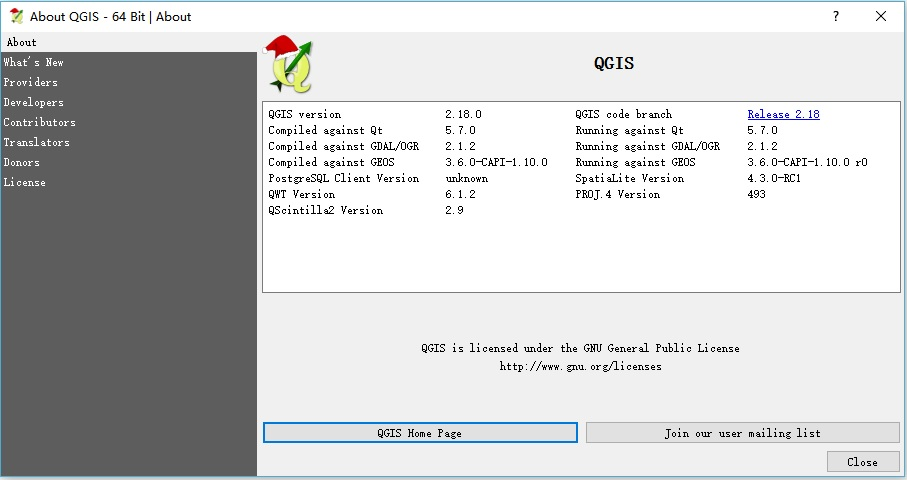

# QGIS Windows Build Qt5 VS2015 x64
---

It is an official build of Qt5-based [QGIS](http://www.qgis.org/) on Windows.

## Warning
It is an official build, so do not use it in **Commercial** purpose.

## Limitations

* Only support features implemented by C++.
* Do not support any features implemented by bindings such as Python.
* Do not support Python-based plugins.

## Run Requirement

Windows 7 64bit and above

## Compilation Information

#### OS:
* Windows 10 64bit 1607 14393.447

#### SDKs:
* Visual Studio 2015 Community Update 3
* Qt5.7 64bit msvc2015

#### 3rdParty:
* [GDAL](http://www.gdal.org/)
* [Win flex-bison](https://sourceforge.net/projects/winflexbison/)
* [GEOS](https://trac.osgeo.org/geos/)
* [FreeXL](https://www.gaia-gis.it/fossil/freexl/index)
* [The Expat XML Parser](http://expat.sourceforge.net/)
* [LIBICONV](https://github.com/kiyolee/libiconv-win-build)
* [PostgreSQL](https://www.postgresql.org/)
* [libspatialindex](https://libspatialindex.github.io/)
* [Libxml2](http://xmlsoft.org/)
* [PROJ.4](https://github.com/OSGeo/proj.4)
* [Qt Cryptographic Architecture](http://delta.affinix.com/docs/qca/)
* [QScintilla](https://riverbankcomputing.com/software/qscintilla/intro)
* [QWT](http://qwt.sourceforge.net/)
* [SpatiaLite](https://www.gaia-gis.it/fossil/libspatialite/index)
* [SQLite3](http://sqlite.org/)
* [zlib](http://zlib.net/)